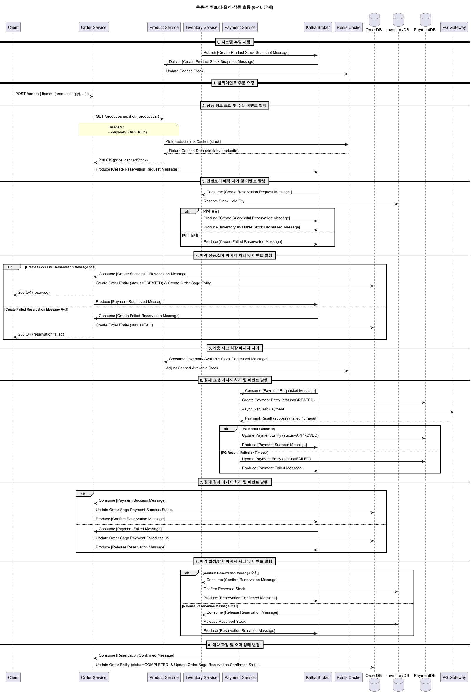

### 프로젝트 소개 및 핵심 가치

**주문(Order)** - **재고(Inventory)** - **결제(Payment)** - **상품(Product)** 4개 서비스로 구성된 커머스 백엔드 프로젝트입니다.





- **Kafka 기반 이벤트 통합(Event Driven Integration)** : 주문 생성 → 재고 예약/확정/해제 → 결제 승인/취소 → 상품 재고 반영 흐름
- **외부 이벤트 선 기록 후 발행하는 Transactional Outbox 패턴** : 분산 환경에서 발생할 수 있는 중복 처리, 메시지 유실 문제 방어
- **Lease 락을 통한 발행 이벤트 선점 방식** : 배치 단위로 Outbox 레코드들을 선점하여 발행하는 방식으로 다중 인스턴스 환경에서의 중복 발행 문제 방어
- **TestContainers 기반 통합 테스트 자동화** : Kafka·DB 등 외부 의존성이 필요한 시나리오를 컨테이너로 구성해 로컬/CI에서 동일 조건으로 실행하며, 실제에 가까운 환경에서 검증
- **Kafka 이벤트 기반 재고 동기화 + Redis 캐시 업데이트** : 재고 변동 이벤트를 구독해 상품 조회 시 재고 서비스 직접 호출 없이 가능하도록 설계
- **관리자 권한 및 내부 서비스 접근 제어(Security)** : 관리자 인증/인가를 위한 JWT 방식과 서비스 간 보호를 위한 API Key 방식 제공
- **멱등성(Idempotency) 보장** : 리소스 생성 이벤트에 대한 idempotency key를 부여하고 DB Unique 제약으로 중복 생성/처리 방어
- **낙관적 락(Optimistic Lock) 기반 동시성 제어** **:** 경합 상황에서 업데이트 충돌을 감지하여 데이터 정합성 보호

---

### 사용한 기술

**Language** : **`Kotlin`**

**Framework** : **`Spring Boot`** **`Spring Data JPA`** **`Spring Security`** **`Spring Data Redis`** **`Spring Kafka`**

**Database** : **`PostgreSQL`** **`Redis`**

**Testing** : **`JUnit`** **`Mockito`** **`TestContainers`**

---

## Kafka 기반 이벤트 통합 (Event Driven Integration)

아래 섹션은 프로젝트의 실제 소스코드 일부를 인용해 "Kafka 기반 이벤트 통합" 설계를 해석한 내용입니다.
인용한 코드는 `order-service` 모듈의 이벤트 정의 파일에서 발췌했습니다.


---

### 1) OrderInboundEvent

파일: `order-service/src/main/kotlin/nuts/commerce/orderservice/event/inbound/OrderInboundEvent.kt`

```Kotlin
data class OrderInboundEvent(
    val eventId: UUID,
    val orderId: UUID,
    val eventType: InboundEventType,

    @field:JsonTypeInfo(
        use = JsonTypeInfo.Id.NAME,
        include = JsonTypeInfo.As.EXTERNAL_PROPERTY,
        property = "eventType"
    )
    @field:JsonSubTypes(
        JsonSubTypes.Type(value = ReservationCreationSucceededPayload::class, name = "RESERVATION_CREATION_SUCCEEDED"),
        JsonSubTypes.Type(value = ReservationCreationFailedPayload::class, name = "RESERVATION_CREATION_FAILED"),
        // ... 다른 페이로드 타입들 ...
    )
    val payload: InboundPayload
)

sealed interface InboundPayload

data class ReservationCreationSucceededPayload(
    val reservationItemInfoList: List<InboundReservationItem>
) : InboundPayload


```

## 설계 의도와 장점

- 서비스 내부로 유입되는 이벤트(예: 재고 예약 성공/실패, 결제 승인/취소 등)를 `XXXInboundEvent` 형식으로 표현하며, `eventType` 필드로 이벤트의 구체 타입을 구분하는 구조로
  설계했습니다. 이를 통해 하나의 Kafka 토픽과 리스너에서 다양한 이벤트를 처리할 수 있습니다.
- 모든 입수 이벤트를 `OrderInboundEvent`라는 공통 엔벨로프 구조로 표현하여, 소비자에서 일관된 방식으로 이벤트를 처리할 수 있도록 설계했습니다.
- Jackson의 다형성 지원(JsonTypeInfo + JsonSubTypes)을 활용해 `eventType`에 따라 `payload`의 구체 타입으로 역직렬화하도록 했습니다. 이를 통해 하나의 토픽과 리스너에서
  다양한 이벤트 타입을 수용할 수 있어 코드 구현이 간결해집니다.
- 각 이벤트 타입별로 명확한 페이로드 클래스를 정의하여, 소비자에서 이벤트 처리 시 타입 안정성과 가독성을 높였습니다.
- 새로운 이벤트 타입이 추가될 때, 관련 DTO와 enum만 추가하면 기존 파이프라인을 그대로 사용할 수 있어 확장성이 좋습니다.
- 공통 메타 정보(`eventId`, `orderId`, `eventType`)를 포함하여 이벤트의 추적과 로깅이 용이하도록 했습니다.

## 리스크 및 개선 사항

- `EXTERNAL_PROPERTY` 방식은 메시지의 JSON 구조에 민감하므로, 브로커에 들어오는 메시지가 스키마와 조금이라도 달라지면 역직렬화 오류가 발생할 수 있습니다. 이를 방지하기 위해 메시지 스키마
  관리와 버전 관리를 철저히 해야 합니다.
- Jackson의 다형성 역직렬화는 구성 오류나 악의적 입력에 취약할 수 있으므로, 허용 타입을 제한하는 추가 안전장치가 필요합니다. 예를 들어, 허용된 이벤트 타입 목록을 화이트리스트로 관리하거나, 수동 매핑
  방식을 도입할 수 있습니다.
- JSON 기반의 수동 스키마 관리는 장기적으로 스키마 진화 관리가 어려워질 수 있으므로, 장기적으로는 Avro나 Protobuf와 같은 스키마 기반 직렬화 형식과 Schema Registry 도입을 권장합니다.

---

### 2) PaymentOutboundEvent (발췌)

파일: `order-service/src/main/kotlin/nuts/commerce/orderservice/event/outbound/PaymentOutboundEvent.kt`

```Kotlin
class PaymentOutboundEvent(
    val eventId: UUID = UUID.randomUUID(),
    val outboxId: UUID,
    val orderId: UUID,
    val eventType: OutboundEventType,
    val payload: PaymentOutboundPayload
)

sealed interface PaymentOutboundPayload

data class PaymentCreatePayload(
    val amount: Long,
    val currency: String = "KRW",
) : PaymentOutboundPayload
```

## 설계 의도와 장점

- 외부로 발행되는 이벤트로 프로젝트 내 모든 서비스에서 `XXXOutboundEvent`라는 공통 구조를 사용하도록 설계했습니다. 이를 통해 이벤트 발행 시 일관된 메타 정보와 페이로드 구조를 유지할 수 있습니다.
- Outbound 이벤트에 `outboxId`를 포함해 DB 레코드와 실제 발행 이벤트를 1:1로 추적 가능하게 설계했습니다.
- 페이로드를 `xxxPayload` 형태로 명확히 구분하여, 소비자 측이 이벤트 타입에 따른 페이로드 구조를 직관적으로 이해할 수 있도록 했습니다.

## 리스크 및 개선 사항
- Outbound 이벤트도 Inbound 이벤트와 마찬가지로 JSON 기반의 수동 스키마 관리가 필요하므로, 메시지 스키마 관리와 버전 관리를 철저히 해야 합니다.


---

## 외부 이벤트 선 기록 후 발행하는 Transactional Outbox 패턴

어플리케이션에서 발생하는 이벤트를 외부 메시지 브로커(Kafka)에 발행할 때, DB 트랜잭션과 메시지 발행의 원자성을 보장하기 위해 Transactional Outbox 패턴을 적용했습니다. 
아래 코드는 `order-service` 모듈의 Outbox 관련 구현에서 발췌한 것으로, 이 패턴의 설계 의도와 장단점, 운영/테스트 권장사항을 설명합니다. 


### 1) OutboxRecord

파일: `order-service/src/main/kotlin/nuts/commerce/orderservice/model/OutboxRecord.kt`

```Kotlin
@Entity
@Table(
    name = "order_outbox_records",
    uniqueConstraints = [UniqueConstraint(columnNames = ["orderId", "idempotency_key"]) ]
)
class OutboxRecord protected constructor(
    @Id
    val outboxId: UUID,

    @Column(nullable = false, updatable = false)
    val orderId: UUID,

    @Enumerated(EnumType.STRING)
    @Column(name = "event_type", nullable = false, updatable = false)
    val eventType: OutboundEventType,

    @Column(name = "idempotency_key", nullable = false, updatable = false)
    val idempotencyKey: UUID,

    @Column(nullable = false)
    var payload: String,

    @Enumerated(EnumType.STRING)
    @Column(nullable = false)
    var status: OutboxStatus,

    @Column(name = "locked_by")
    var lockedBy: String?,

    @Column(name = "locked_until")
    var lockedUntil: Instant?,

    @Column(name = "attempt_count", nullable = false)
    var attemptCount: Int,

    @Column(name = "next_attempt_at", nullable = false)
    var nextAttemptAt: Instant
) : BaseEntity() {
}
```

#### 설계 의도 
- Outbox 레코드를 비즈니스 트랜잭션 내부에서 생성하여 DB에 영속화합니다. 이후 별도의 이벤트 발행을 담당하는 워커가 이 레코드를 읽어 브로커로 전송합니다.
- 중복 요청 방지를 위해 `orderId`와 `idempotency_key`에 대한 unique constraint를 설정했습니다. 이를 통해 동일한 비즈니스 요청에 대해 중복된 Outbox 레코드 생성을 방지할 수 있습니다.
- 상태(`status`), 락(`lockedBy`/`lockedUntil`), 재시도 관련 필드(`attemptCount`, `nextAttemptAt`)를 포함하여, 발행 워커에서 안전하게 레코드를 선점(claim)하고, 재시도 및 DLQ 처리 로직을 구현할 수 있도록 설계했습니다.
- Outbox 레코드에 이벤트 타입과 페이로드를 포함하여, 발행 워커가 레코드를 읽어 적절한 이벤트 객체로 변환하여 브로커로 전송할 수 있도록 했습니다.

#### 리스크 및 개선 사항
- Outbox 테이블이 커지면 성능(쿼리 비용, 인덱스 관리 등)과 운영 부담이 증가할 수 있습니다. 주기적인 정리/보관 전략이 필요합니다.
- 선점/락 해제 로직이 잘못되면 레코드가 장시간 잠겨 영구적으로 처리되지 않는 상황이 발생할 수 있으며, 이를 위해 락 타임아웃과 모니터링을 적절히 설정해야 합니다.


---

### 2) OutboxPublishUseCase

파일: `order-service/src/main/kotlin/nuts/commerce/orderservice/usecase/OutboxPublishUseCase.kt`

```kotlin
fun execute() {
    val claimedOutboxResults = outboxRepository.claimAndLockBatchIds(batchSize, claimLockedBy)
    if (claimedOutboxResults.size == 0) return

    claimedOutboxResults.outboxInfo.forEach { outboxInfo ->
        when (outboxInfo.eventType.eventClass) {
            ReservationOutboundEvent::class.java ->
                reservationEventConverterMap[outboxInfo.eventType]?.let { converter ->
                    reservationEventProducing(converter.convert(outboxInfo))
                } ?: throw IllegalArgumentException("No converter found for event type: ${outboxInfo.eventType}")

            PaymentOutboundEvent::class.java ->
                paymentEventConverterMap[outboxInfo.eventType]?.let { converter ->
                    paymentEventProducing(converter.convert(outboxInfo))
                } ?: throw IllegalArgumentException("No converter found for event type: ${outboxInfo.eventType}")

            else -> throw IllegalArgumentException("Unsupported event class: ${outboxInfo.eventType.eventClass}")
        }
    }
}

private fun paymentEventProducing(event: PaymentOutboundEvent) {
    paymentEventProducer.produce(event)
        .whenCompleteAsync(
            { result, _ ->
                when (result) {
                    is ProduceResult.Success -> outboxRepository.markPublished(result.outboxId, claimLockedBy)
                    is ProduceResult.Failure -> outboxRepository.markFailed(result.outboxId, claimLockedBy)
                }
            }, outboxUpdateExecutor
        )
}
```


