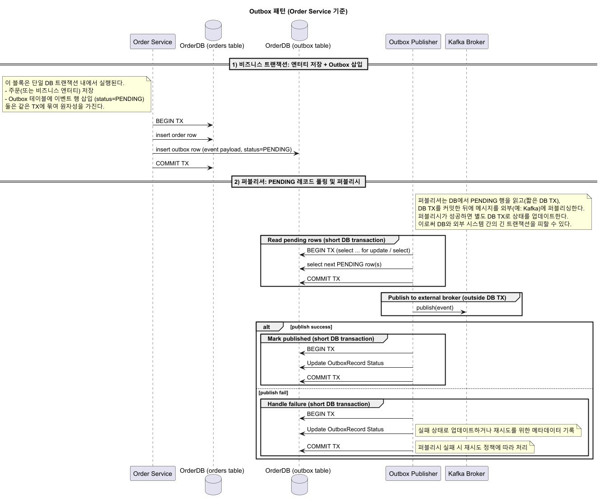

## 개요

**주문(Order)** - **재고(Inventory)** - **결제(Payment)** - **상품(Product)** 4개 서비스로 구성된 마이크로서비스 아키텍처 기반의 커머스 시스템이다.
각 서비스는 카프카를 통한 이벤트 기반 통합(Event Driven Integration)으로 연결되어 있으며, Transactional Outbox 패턴과 Lease 락을 활용한 선점 방식으로 이벤트 발행의
원자성과 중복 방어를 보장한다.

---

## 이벤트 기반 통합 대표 시나리오 다이어그램

커머스 도메인에서 발생할 수 있는 대표적인 시나리오 중 하나로 주문 생성 관련하여 프로젝트에서도 재현했으며,
아래 다이어그램은 프로젝트에서 설계한 주문 생성 → 재고 예약/확정/해제 → 결제 승인/취소 → 상품 재고 반영 흐름을 시각적으로 표현한 것이다.


--- 

## 사용한 기술

**Language** : **`Kotlin`**

**Framework** : **`Spring Boot`** **`Spring Data JPA`** **`Spring Security`** **`Spring Data Redis`** **`Spring Kafka`**

**Database** : **`PostgreSQL`** **`Redis`**

**Testing** : **`JUnit`** **`Mockito`** **`TestContainers`**

--- 

## 주요 설계 특징

1) **Kafka 기반 이벤트 통합(Event Driven Integration)** : 주문 생성 → 재고 예약/확정/해제 → 결제 승인/취소 → 상품 재고 반영 흐름
2) **외부 이벤트 선 기록 후 발행하는 Transactional Outbox 패턴** : 분산 환경에서 발생할 수 있는 중복 처리, 메시지 유실 문제 방어
3) **Lease 락을 통한 발행 이벤트 선점 방식** : 배치 단위로 Outbox 레코드들을 선점하여 발행하는 방식으로 다중 인스턴스 환경에서의 중복 발행 문제 방어
4) **TestContainers 기반 통합 테스트 자동화** : Kafka·DB 등 외부 의존성이 필요한 시나리오를 컨테이너로 구성해 로컬/CI에서 동일 조건으로 실행하며, 실제에 가까운 환경에서 검증
5) **Kafka 이벤트 기반 재고 동기화 + Redis 캐시 업데이트** : 재고 변동 이벤트를 구독해 상품 조회 시 재고 서비스 직접 호출 없이 가능하도록 설계
6) **관리자 권한 및 내부 서비스 접근 제어(Security)** : 관리자 인증/인가를 위한 JWT 방식과 서비스 간 보호를 위한 API Key 방식 제공
7) **멱등성(Idempotency) 보장** : 리소스 생성 이벤트에 대한 idempotency key를 부여하고 DB Unique 제약으로 중복 생성/처리 방어

---

### 1) Kafka 기반 이벤트 통합 (Event Driven Integration)

커머스 시스템에서 주문 생성, 재고 예약/확정/해제, 결제 승인/취소, 상품 재고 반영 등 다양한 이벤트가 발생하며, 이를 Kafka를 통한 이벤트 기반 통합으로 연결하는 통합 시나리오 설계했다.

### OrderInboundEvent

파일: `order-service/src/main/kotlin/nuts/commerce/orderservice/event/inbound/OrderInboundEvent.kt`

```Kotlin
data class OrderInboundEvent(
    val eventId: UUID,
    val orderId: UUID,
    val eventType: InboundEventType,

    @field:JsonTypeInfo(
        use = JsonTypeInfo.Id.NAME,
        include = JsonTypeInfo.As.EXTERNAL_PROPERTY,
        property = "eventType"
    )
    @field:JsonSubTypes(
        JsonSubTypes.Type(value = ReservationCreationSucceededPayload::class, name = "RESERVATION_CREATION_SUCCEEDED"),
        JsonSubTypes.Type(value = ReservationCreationFailedPayload::class, name = "RESERVATION_CREATION_FAILED"),
        // ... 다른 페이로드 타입들 ...
    )
    val payload: InboundPayload
)

sealed interface InboundPayload

data class ReservationCreationSucceededPayload(
    val reservationItemInfoList: List<InboundReservationItem>
) : InboundPayload


```

#### 설계 의도와 장점

- 서비스 내부로 유입되는 이벤트(예: 재고 예약 성공/실패, 결제 승인/취소 등)를 `XXXInboundEvent` 형식으로 표현하며, `eventType` 필드로 이벤트의 구체 타입을 구분하는 구조로
  설계했으며, 이를 통해 하나의 Kafka 토픽과 리스너에서 다양한 이벤트를 처리할 수 있다.
- 모든 입수 이벤트를 `OrderInboundEvent`라는 공통 엔벨로프 구조로 표현하여, 소비자에서 일관된 방식으로 이벤트를 처리할 수 있도록 설계했다.
- Jackson의 다형성 지원(JsonTypeInfo + JsonSubTypes)을 활용해 `eventType`에 따라 `payload`의 구체 타입으로의 역직렬화를 지원한다. 이를 통해 하나의 토픽과 리스너에서
  다양한 이벤트 타입을 수용할 수 있고 코드 유연성과 확장성을 높였다.
- 각 이벤트 타입별로 명확한 페이로드 클래스를 정의하여, 소비자에서 이벤트 처리 시 타입 안정성과 가독성을 높였다.
- 공통 메타 정보(`eventId`, `orderId`, `eventType`)를 포함하여 이벤트의 추적과 로깅이 용이하도록 했습니다.

#### 리스크 및 개선 사항

- `EXTERNAL_PROPERTY` 방식은 메시지의 JSON 구조에 민감하므로, 브로커에 들어오는 메시지가 스키마와 조금이라도 달라지면 역직렬화 오류가 발생할 수 있다.
- Jackson의 다형성 역직렬화는 구성 오류나 악의적 입력에 취약할 수 있으므로, 허용 타입을 제한하는 추가 안전장치가 필요하다. 예를 들어, 허용된 이벤트 타입 목록을 화이트리스트로 관리하거나, 수동 매핑
  방식을 도입하는 방안은 선택할 수 있다.
- 추후 Avro, Protobuf 등 스키마 기반 직렬화 라이브러리를 도입하여 메시지 스키마 관리와 버전 관리를 체계적으로 하는 방안도 고려할 수 있다.

---

### PaymentOutboundEvent

파일: `order-service/src/main/kotlin/nuts/commerce/orderservice/event/outbound/PaymentOutboundEvent.kt`

```Kotlin
class PaymentOutboundEvent(
    val eventId: UUID = UUID.randomUUID(),
    val outboxId: UUID,
    val orderId: UUID,
    val eventType: OutboundEventType,
    val payload: PaymentOutboundPayload
)

sealed interface PaymentOutboundPayload

data class PaymentCreatePayload(
    val amount: Long,
    val currency: String = "KRW",
) : PaymentOutboundPayload
```

#### 설계 의도와 장점

- 외부로 발행되는 이벤트로 프로젝트 내 모든 서비스에서 `XXXOutboundEvent`라는 공통 구조를 사용하도록 설계했습니다. 이를 통해 이벤트 발행 시 일관된 메타 정보와 페이로드 구조를 유지할 수 있습니다.
- Outbound 이벤트에 `outboxId`를 포함해 DB 레코드와 실제 발행 이벤트를 1:1로 추적 가능하게 설계했습니다.
- 페이로드를 `xxxPayload` 형태로 명확히 구분하여, 소비자 측이 이벤트 타입에 따른 페이로드 구조를 직관적으로 이해할 수 있도록 했습니다.

#### 리스크 및 개선 사항

- Outbound 이벤트도 Inbound 이벤트와 마찬가지로 JSON 기반의 수동 스키마 관리가 필요하므로, 메시지 스키마 관리와 버전 관리를 철저히 해야 합니다.

### OrderEventListener

파일: `order-service/src/main/kotlin/nuts/commerce/orderservice/adapter/system/OrderEventListener.kt`

```Kotlin
@ConditionalOnProperty(
    prefix = "system.order-event-listener",
    name = ["enabled"],
    havingValue = "true",
    matchIfMissing = true
)
@Component
class OrderEventListener(
    inboundEventHandlerList: List<InboundEventHandler>
) {
    private val orderEventListenerMap: Map<InboundEventType, InboundEventHandler> =
        inboundEventHandlerList.associateBy { it.supportType }

    @KafkaListener(
        topics = [$$"${system.order-event-listener.topic}"],
        groupId = $$"${system.order-event-listener.group-id}",
    )
    fun onMessage(
        @Payload inboundEvent: OrderInboundEvent
    ) {
        val handler = orderEventListenerMap[inboundEvent.eventType]
            ?: throw IllegalArgumentException("No handler found for event type: ${inboundEvent.eventType}")

        handler.handle(inboundEvent)
    }
}
```

#### 설계 의도와 장점

- KafkaListener를 통해 단일 타입의 `OrderInboundEvent`를 수신하여, 이벤트 타입에 따라 적절한 핸들러로 위임하는 구조로 설계했다.
- 각 이벤트 타입별로 별도의 클래스에서 처리 로직을 구현하는 `InboundEventHandler` 인터페이스를 도입하여, 이벤트 처리 로직의 관심사 분리와 코드 유지보수성을 높였다.
- `ConditionalOnProperty`을 활용해 이벤트 리스너의 활성화 여부를 설정으로 제어할 수 있도록 하여, 테스트 환경에서는 비활성화하고, 운영 환경에서는 활성화하는 유연성을 제공한다.

---

## 2) 외부 이벤트 선 기록 후 발행하는 Transactional Outbox 패턴

어플리케이션에서 발생하는 이벤트를 외부 메시지 브로커(Kafka)에 발행할 때, DB 트랜잭션과 메시지 발행의 원자성을 보장하기 위해 Transactional Outbox 패턴을 적용했다.
아래 코드는 `order-service` 모듈의 Outbox 관련 구현에서 발췌한 것으로, 이 패턴의 설계 의도와 장단점을 설명한다.

### OutboxRecord

파일: `order-service/src/main/kotlin/nuts/commerce/orderservice/model/OutboxRecord.kt`

```Kotlin
@Entity
@Table(
    name = "order_outbox_records",
    uniqueConstraints = [UniqueConstraint(columnNames = ["orderId", "idempotency_key"])]
)
class OutboxRecord protected constructor(
    @Id
    val outboxId: UUID,

    @Column(nullable = false, updatable = false)
    val orderId: UUID,

    @Enumerated(EnumType.STRING)
    @Column(name = "event_type", nullable = false, updatable = false)
    val eventType: OutboundEventType,

    @Column(name = "idempotency_key", nullable = false, updatable = false)
    val idempotencyKey: UUID,

    @Column(nullable = false)
    var payload: String,

    @Enumerated(EnumType.STRING)
    @Column(nullable = false)
    var status: OutboxStatus,

    @Column(name = "locked_by")
    var lockedBy: String?,

    @Column(name = "locked_until")
    var lockedUntil: Instant?,

    @Column(name = "attempt_count", nullable = false)
    var attemptCount: Int,

    @Column(name = "next_attempt_at", nullable = false)
    var nextAttemptAt: Instant
) : BaseEntity() {
}
```

#### 설계 의도와 장점

- Outbox 레코드를 비즈니스 트랜잭션 내부에서 생성하여 DB에 영속화합니다. 이후 별도의 이벤트 발행을 담당하는 워커가 이 레코드를 읽어 브로커로 전송합니다.
- 중복 요청 방지를 위해 `orderId`와 `idempotency_key`에 대한 unique constraint를 설정했습니다. 이를 통해 동일한 비즈니스 요청에 대해 중복된 Outbox 레코드 생성을 방지할
  수 있습니다.
- 상태(`status`), 락(`lockedBy`/`lockedUntil`), 재시도 관련 필드(`attemptCount`, `nextAttemptAt`)를 포함하여, 발행 워커에서 안전하게 레코드를 선점(
  claim)하고, 재시도 및 DLQ 처리 로직을 구현할 수 있도록 설계했습니다.
- Outbox 레코드에 이벤트 타입과 페이로드를 포함하여, 발행 워커가 레코드를 읽어 적절한 이벤트 객체로 변환하여 브로커로 전송할 수 있도록 했습니다.

#### 리스크 및 개선 사항

- Outbox 테이블이 커지면 성능(쿼리 비용, 인덱스 관리 등)과 운영 부담이 증가할 수 있습니다. 주기적인 정리/보관 전략이 필요합니다.
- 선점/락 해제 로직이 잘못되면 레코드가 장시간 잠겨 영구적으로 처리되지 않는 상황이 발생할 수 있으며, 이를 위해 락 타임아웃과 모니터링을 적절히 설정해야 합니다.

#### Outbox 패턴 적용 시나리오 다이어그램


---

### OutboxPublishUseCase / OutboxPublisher

파일: `order-service/src/main/kotlin/nuts/commerce/orderservice/usecase/OutboxPublishUseCase.kt`

```kotlin
fun execute() {
    val claimedOutboxResults = outboxRepository.claimAndLockBatchIds(batchSize, claimLockedBy)
    if (claimedOutboxResults.size == 0) return

    claimedOutboxResults.outboxInfo.forEach { outboxInfo ->
        when (outboxInfo.eventType.eventClass) {
            ReservationOutboundEvent::class.java ->
                reservationEventConverterMap[outboxInfo.eventType]?.let { converter ->
                    reservationEventProducing(converter.convert(outboxInfo))
                } ?: throw IllegalArgumentException("No converter found for event type: ${outboxInfo.eventType}")

            PaymentOutboundEvent::class.java ->
                paymentEventConverterMap[outboxInfo.eventType]?.let { converter ->
                    paymentEventProducing(converter.convert(outboxInfo))
                } ?: throw IllegalArgumentException("No converter found for event type: ${outboxInfo.eventType}")

            else -> throw IllegalArgumentException("Unsupported event class: ${outboxInfo.eventType.eventClass}")
        }
    }
}

private fun paymentEventProducing(event: PaymentOutboundEvent) {
    paymentEventProducer.produce(event)
        .whenCompleteAsync(
            { result, _ ->
                when (result) {
                    is ProduceResult.Success -> outboxRepository.markPublished(result.outboxId, claimLockedBy)
                    is ProduceResult.Failure -> outboxRepository.markFailed(result.outboxId, claimLockedBy)
                }
            }, outboxUpdateExecutor
        )
}
```

파일: `order-service/src/main/kotlin/nuts/commerce/orderservice/adapter/system/OutboxPublisher.kt`

```kotlin
@Component
@ConditionalOnProperty(
    prefix = "system.outbox-publisher",
    name = ["enabled"],
    havingValue = "true",
    matchIfMissing = true
)
class OutboxPublisher(private val outboxPublishUseCase: OutboxPublishUseCase) {

    @Scheduled(fixedDelayString = \ "${system.outbox-publisher.fixed-delay:5000}\")
    fun publishOutbox() {
        println("[OutboxPublisher] Starting outbox publish process...")
        outboxPublishUseCase.execute()
    }
}
```

#### 설계 의도와 장점

- `claimAndLockBatchIds`로 배치 단위로 Outbox 레코드를 선점(claim)하여, 다중 인스턴스 환경에서 중복 발행을 방지한다.
- 각 레코드에 대해 이벤트 타입에 맞는 변환기를 통해 Outbound 이벤트 객체로 변환한 뒤, 비동기 프로듀서로 전송한다.
- 전송 결과 콜백에서 성공/실패를 판별하여 Outbox 레코드의 상태를 업데이트(`markPublished`, `markFailed`)한다. 상태 업데이트는 별도 executor에서 비동기 처리해 발행 처리
  스루풋을 높인다.
- 이벤트 타입별로 변환기 맵을 활용해 이벤트 객체로의 변환 로직을 깔끔하게 분리하여, 새로운 이벤트 타입 추가 시에도 기존 코드를 최소한으로 수정할 수 있도록 설계할 수 있다.
- 주기적 스케줄러로 발행 프로세스를 실행하여, Outbox 레코드가 생성된 후 최대 지연 시간을 제어할 수 있다.
- `ConditionalOnProperty`을 활용해 OutboxPublisher의 활성화 여부를 설정으로 제어할 수 있도록 하여, 테스트 환경에서는 비활성화하고, 운영 환경에서는 활성화하는 유연성을 제공한다.

#### 리스크 및 개선 사항

- 어플리케이션 코드 상에서 제공하는 기능만으로든 완전한 원자성, 동시성 문제를 해결하기 어렵다.
- 퍼블리싱 과정에서의 경합이 의도치않게 발생할 가능성을 배제할 수 없으며 이를 위해 DB의 락 기능을 적극 활용하는 것이 중요하다.
- `FOR UPDATE SKIP LOCKED` 와 같은 데이터베이스 네이티브 기능을 사용하는 것으로 문제 완화를 도모할 수 있다.

--- 

## 3) Lease 락을 통한 발행 이벤트 선점 방식

Outbox 레코드를 선점(claim)하는 방식으로 이벤트 발행을 처리하는 설계에서, Lease 락을 활용하여 다중 인스턴스 환경에서의 중복 발행 문제를 방어하는 방식에 대한 설명이다.

### JpaOutboxRepository

파일: ``order-service/src/main/kotlin/nuts/commerce/orderservice/adapter/repository/JpaOutboxRepository.kt`
`

```kotlin
// find candidates (선점 대상 조회)
@Query(
    """
    select o.outboxId
      from OutboxRecord o
     where o.status = :outboxStatus
       and o.nextAttemptAt <= :now
       and (o.lockedUntil is null or o.lockedUntil < :now)
     order by o.createdAt
"""
)
fun findClaimCandidates(
    @Param("now") now: Instant,
    pageable: Pageable,
    @Param("outboxStatus") outboxStatus: OutboxStatus
): List<UUID>

// claim (선점, 상태 전환 및 lease 설정)
@Modifying(clearAutomatically = true, flushAutomatically = true)
@Query(
    """
    update OutboxRecord o
       set o.lockedBy = :workerId,
           o.status = :newStatus,
           o.lockedUntil = :leaseUntil
     where o.outboxId in :ids
       and o.status = :expectedStatus
       and (o.lockedUntil is null or o.lockedUntil < :now)
"""
)
fun claimBatch(
    @Param("ids") ids: List<UUID>,
    @Param("workerId") workerId: String,
    @Param("expectedStatus") expectedStatus: OutboxStatus,
    @Param("newStatus") newStatus: OutboxStatus,
    @Param("now") now: Instant,
    @Param("leaseUntil") leaseUntil: Instant
): Int

// mark published/failure (선점 소유자의 상태 변경)
@Modifying(clearAutomatically = true, flushAutomatically = true)
@Query(
    """
    update OutboxRecord o
       set o.status = :newStatus,
           o.lockedBy = null,
           o.lockedUntil = null
     where o.outboxId = :outboxId
       and o.lockedBy = :lockedBy
       and o.nextAttemptAt <= :now
       and o.status = :expectedStatus
    """
)
fun markOutboxStatus(
    outboxId: UUID,
    lockedBy: String,
    now: Instant,
    expectedStatus: OutboxStatus,
    newStatus: OutboxStatus
): Int

```

#### 설계 의도와 장점

- JPA의 `@Query`와 `@Modifying`을 활용해 선점 대상 조회와 선점 업데이트를 각각 구현한다.
- `findClaimCandidates`로 먼저 처리 후보의 ID 목록을 페이징으로 조회하여, 선점 대상 범위를 축소한다. 이때 `lockedUntil` 조건으로 이미 유효한 lease를 갖는 레코드는 건너뛴다.
- `claimBatch`로 단일 업데이트 쿼리를 통해 `lockedBy`, `lockedUntil`과 상태(예: PROCESSING)를 설정한다. 이때 조건(
  `lockedUntil is null or lockedUntil < now`)으로 이미 유효한 lease를 갖는 레코드는 건너뛴다.
- 조회 후 선점 업데이트까지의 짧은 시간 동안에도 다른 인스턴스가 동일 레코드를 선점하는 것을 방지하기 위해, `claimBatch`의 조건절에서 `lockedUntil`을 체크하여 이미 유효한 lease가 있는
  레코드는 건너뛴다.
- 발행 성공/실패 후에는 `markOutboxStatus`를 호출하여 소유자 검증(`lockedBy = :lockedBy`) 하에 상태를 PUBLISHED/FAILED로 바꾸고 락을 해제한다. 이를 통해 선점한
  워커만이 해당 레코드의 상태를 변경할 수 있도록 보장한다.


- 굳이 선점 대상 조회와 선점 업데이트를 분리하여 구현한 이유는, 선점 대상 조회 시 페이징을 활용해 처리할 레코드 수를 제어할 수 있고, 선점 업데이트는 단일 쿼리로 처리하여 성능을 최적화하기 위함이다.

#### 리스크 및 개선 사항

- 처리 시간이 lease 기간보다 길어질 경우(대량 전송, 네트워크 지연 등) 현재 워커가 처리 중인데도 lease가 만료되어 다른 워커가 동일 레코드를 다시 선점할 수 있음 → 중복 발행 위험이 존재한다. 이를
  완화하기 위해서는 lease 기간을 충분히 여유 있게 설정하거나, 처리 중인 워커가 주기적으로 lease를 갱신하는 heartbeat 메커니즘을 도입하는 방안을 고려할 수 있다.
- `claimBatch`의 조건절이 복잡해지면 인덱스/실행계획에 따라 성능 이슈가 발생할 수 있다. 특히 `lockedUntil` 조건이 있는 경우, 적절한 인덱스 설계와 쿼리 최적화가 필요하다.
- 선점 대상 조회와 선점 업데이트를 분리하여 구현한 이유는 별도의 데이터베이스 락 기능을 활용하지 않고도 선점 로직을 구현하기 위함이지만, 데이터베이스 벤더에서 제공하는 `FOR UPDATE SKIP LOCKED`
  와 같은 기능을 활용하면 select-for-update 기반 선점이 가능이 가능하다. 이 저장소는 명시적 업데이트 기반 선점을 사용하지만, 필요 시 SKIP LOCKED 전략으로 전환하는 것도 고려할 수 있다.

## 4) TestContainers 기반 통합 테스트 자동화

커머스 시스템의 이벤트 기반 통합 시나리오를 실제에 가까운 환경에서 검증하기 위해 TestContainers를 활용한 통합 테스트 자동화 전략을 설계했다. 아래는 `order-service` 모듈의 통합 테스트 예시
코드로, 이 전략의 설계 의도와 장단점을 설명한다.

### KafkaPaymentEventProducerTest

파일: `order-service/src/test/kotlin/nuts/commerce/orderservice/adapter/message/KafkaPaymentEventProducerTest.kt`

```kotlin
@Suppress("NonAsciiCharacters")
@SpringBootTest(
    classes = [KafkaPaymentEventProducer::class]
)
@ImportAutoConfiguration(KafkaAutoConfiguration::class)
class KafkaPaymentEventProducerTest {

    @Autowired
    lateinit var producer: KafkaPaymentEventProducer

    companion object {
        @Container
        @ServiceConnection
        val kafka: KafkaContainer = KafkaContainer(DockerImageName.parse("apache/kafka:3.7.0"))
    }

    @Test
    fun `이벤트를 성공적으로 프로듀스할 수 있다`() {
        // given
        val outboxId = UUID.randomUUID()
        val orderId = UUID.randomUUID()
        val paymentId = UUID.randomUUID()
        val eventId = UUID.randomUUID()
        val providerPaymentId = UUID.randomUUID()

        val event = PaymentOutboundEvent(
            eventId = eventId,
            outboxId = outboxId,
            orderId = orderId,
            paymentId = paymentId,
            eventType = OutboundEventType.PAYMENT_CONFIRM,
            payload = PaymentConfirmSuccessPayload(
                paymentProvider = "TOSS",
                providerPaymentId = providerPaymentId
            )
        )

        // when
        val resultFuture = producer.produce(event)
        val result = resultFuture.get(10, TimeUnit.SECONDS)

        // then
        assertNotNull(result)
        assertTrue(result is ProduceResult.Success)
        assertEquals(eventId, (result as ProduceResult.Success).eventId)
        assertEquals(outboxId, result.outboxId)
    }
    // ... 추가적인 테스트 케이스들 (예: 프로듀스 실패 시나리오, 이벤트 필드 검증 등) ...
}
```

#### 설계 의도와 장점

- TestContainers의 `@Container`와 `@ServiceConnection`을 활용해 테스트 클래스 내에서 Kafka 컨테이너를 자동으로 기동하고, Spring Boot의
  KafkaAutoConfiguration과 연동하여 테스트 시점에 실제 Kafka 브로커에 연결하도록 구성했다.
- `@SpringBootTest`와 `@ImportAutoConfiguration`을 활용해 Kafka 관련 빈만 로드하여, 테스트의 범위를 Kafka 프로듀서와 브로커 간의 상호작용으로 집중할 수 있도록 했다.
- 실제 Kafka 브로커와의 통신을 통해 프로듀서의 직렬화, 네트워크, 전송 경로를 검증할 수 있으며, 이를 통해 로컬/CI 환경에서 브로커 의존성을 테스트 컨테이너로 격리하여 테스트 신뢰도를 높였다.

### JpaOrderRepositoryTest

파일: `order-service/src/test/kotlin/nuts/commerce/orderservice/adapter/repository/JpaOrderRepositoryTest.kt`

```kotlin
@Suppress("NonAsciiCharacters")
@DataJpaTest
@Import(JpaOrderRepository::class)
@AutoConfigureTestDatabase(replace = AutoConfigureTestDatabase.Replace.NONE)
class JpaOrderRepositoryTest {

    @Autowired
    private lateinit var repository: JpaOrderRepository

    companion object {
        @ServiceConnection
        @Container
        val db = PostgreSQLContainer(DockerImageName.parse("postgres:15.3-alpine"))
    }


    @Test
    fun `userId와 idempotencyKey로 Order를 조회할 수 있다`() {
        // given
        val orderId = UUID.randomUUID()
        val userId = "user456"
        val idempotencyKey = UUID.randomUUID()

        val order = Order.create(
            orderId = orderId,
            idempotencyKey = idempotencyKey,
            userId = userId
        )
        val items = listOf(
            OrderItem.create(
                productId = UUID.randomUUID(),
                qty = 1,
                unitPrice = Money(10000, "KRW")
            )
        )
        order.addItems(items)
        repository.save(order)

        // when
        val found = repository.findByUserIdAndIdempotencyKey(userId, idempotencyKey)

        // then
        assertNotNull(found)
        assertEquals(orderId, found?.orderId)
        assertEquals(userId, found?.userId)
    }
}
```

#### 설계 의도와 장점

- TestContainers의 `@Container`와 `@ServiceConnection`을 활용해 테스트 클래스 내에서 PostgreSQL 컨테이너를 자동으로 기동하고, Spring Data JPA의
  `@DataJpaTest`와 연동하여 테스트 시점에 실제 PostgreSQL 데이터베이스에 연결하도록 구성했다.
- `@AutoConfigureTestDatabase(replace = AutoConfigureTestDatabase.Replace.NONE)`을 사용하여 Spring Boot의 테스트용 인메모리 데이터베이스 자동
  구성을 비활성화하고, TestContainers로 제공되는 실제 데이터베이스를 사용하도록 했다.
- 인메모리 데이터베이스(H2 등)와 달리, PostgreSQL의 고유한 동작(예: locking, unique constraint 위반 시 예외 유형 등)을 실제 데이터베이스에서 검증할 수 있다.
- 실제 PostgreSQL 데이터베이스와의 상호작용을 통해 JPA 매핑, SQL 쿼리, 트랜잭션 격리도 등 데이터베이스 특정 동작을 검증할 수 있으며, 이를 통해 로컬/CI 환경에서 데이터베이스 의존성을 테스트
  컨테이너로 격리하여 테스트 신뢰도를 높였다.

#### 리스크 및 개선 사항

- TestContainers는 Docker 환경을 필요로 하므로, CI 러너나 로컬 개발 환경에서 Docker 권한이 필요하다. 이를 해결하기 위해서는 CI 설정에서 Docker 지원이 활성화되어 있는지 확인하고,
  로컬에서는 Docker Desktop과 같은 도구를 설치해야 한다.
- 컨테이너 기동 시간이 테스트 시간에 추가되므로, 병렬 테스트 실행 시 리소스 부족으로 인한 테스트 실패를 방지하기 위해, 테스트 클래스나 메서드 단위로 컨테이너를 공유하거나, 테스트 실행 전략을 조정하는 방안을
  고려할 수 있다.

## 5) Kafka 이벤트 기반 재고 동기화 + Redis 캐시 업데이트

클라이언트 측에서 상품에 대한 재고 정보를 조회할 때, 재고 서비스에 직접 API 호출을 하는 대신, Kafka 이벤트를 기반으로 상품 서비스 내에서 재고 정보를 동기화하여 Redis 캐시에 저장하는 방식을
설계했다.

### ProductEventListener & StartUpRunner

파일 : `product-service/src/main/kotlin/nuts/commerce/productservice/adapter/system/ProductEventListener`

```kotlin
@ConditionalOnProperty(
    prefix = "system.product-event-listener",
    name = ["enabled"],
    havingValue = "true",
    matchIfMissing = true
)
@Component
class ProductEventListener(handlers: List<ProductEventHandler>) {
    private val handlerMap: Map<InboundEventType, ProductEventHandler> =
        handlers.associateBy { it.supportType }

    @PostConstruct
    fun init() {
        val supportedTypes = handlerMap.keys.joinToString(", ")
        println("ProductEventListener initialized with handlers for event types: $supportedTypes")
    }

    @KafkaListener(
        topics = [$$"${system.product-event-listener.topic}"],
        groupId = $$"${system.product-event-listener.group-id}",
    )
    fun onMessage(@Payload inboundEvent: ProductInboundEvent) {
        handlerMap[inboundEvent.eventType]?.handle(inboundEvent)
            ?: throw IllegalArgumentException("No handler found for event type: ${inboundEvent.eventType}")
    }
}

enum class InboundEventType {
    INCREMENT_STOCK,
    DECREMENT_STOCK,
    CREATED
}
```

파일 : `inventory-service/src/main/kotlin/nuts/commerce/inventoryservice/adapter/system/StartUpRunner`

```kotlin
@ConditionalOnProperty(
    prefix = "system.startup-runner",
    name = ["enabled"],
    havingValue = "true",
    matchIfMissing = true
)
@Component
class StartUpRunner(private val publishCurrentStockOnStartUp: PublishCurrentStockOnStartUp) : CommandLineRunner {

    private val logger = LoggerFactory.getLogger(StartUpRunner::class.java)

    @PostConstruct
    fun init() {
        logger.info("StartUpRunner initialized. Will publish current stock on startup.")
    }

    override fun run(vararg args: String) {
        publishCurrentStockOnStartUp.publish()
    }
}
```

#### 설계 의도와 장점

- 재고 서비스가 구동될 때 최초로 현재 재고 정보를 Kafka로 발행하여, 상품 서비스가 이를 구독해 Redis 캐시에 초기 재고 정보를 동기화하도록 설계했다.
- 상품 서비스의 리스너가 받는 이벤트 중 재고 생성, 증가, 감소 이벤트에 대한 핸들러에서 Redis 캐시에 재고 정보를 업데이트하도록 설계했다. 이를 통해 상품 조회 시 재고 서비스에 대한 네트워크 호출 없이
  Redis 캐시에서 빠르게 재고 정보를 조회할 수 있도록
  하여, 시스템의 응답성을 높이는 동시에 재고 서비스에 대한 부하를 줄이는 효과를 기대할 수 있다.
- 이러한 방식을 통해 재고 정보의 최종 일관성(Eventual Consistency)을 보장하면서도, 시스템의 확장성과 성능을 개선할 수 있다.
- `ConditionalOnProperty`을 활용해 이벤트 리스너와 스타트업 러너의 활성화 여부를 설정으로 제어할 수 있도록 하여, 테스트 환경에서는 비활성화하고, 운영 환경에서는 활성화하는 유연성을 제공한다.

#### 리스크 및 개선 사항

- 재고 정보가 실시간으로 반영되지 않고 이벤트 처리 및 Redis 업데이트 시점에 따라 지연이 발생할 수 있다. 이를 완화하기 위해서는 이벤트 처리 속도를 최적화하고, Redis 업데이트 로직을 효율적으로 구현하는
  것이 중요하다.
- 재고 변화 이벤트에 따라 캐시를 업데이트하기 때문에 별도의 조회가 없더라도 재고 변화가 빈번한 상품의 경우 캐시 업데이트가 자주 발생할 수 있다. 이는 불필요한 부하로 이어질 수 있다.
- 비즈니스 요구사항에 따라, 재고 정보의 일관성 요구 수준이 높아지는 경우에는, 이벤트 기반 동기화 외에도 API 호출을 통한 실시간 조회 방식을 보완적으로 제공하는 방안을 고려할 수 있다.

## 6) 관리자 권한 및 내부 서비스 접근 제어(Security)

관리자 권한이 필요한 API에 대해서는 JWT 기반 인증/인가를 적용하고, 서비스 간 통신에서는 API Key 방식을 활용하여 접근 제어를 구현했다.
Spring Security에서 제공하는 `AuthenticationFilter` 커스텀을 통해 JWT와 API Key 방식을 지원하도록 했으며, 인증 처리를 위한 각각의 `AuthenticationProvider`
를
구현하여, 인증 로직을 명확히 분리했다.

### JwtOrApiKeyAuthenticationFilter

파일 :
`product-service/src/main/kotlin/nuts/commerce/productservice/adapter/security/filter/JwtOrApiKeyAuthenticationFilter`

```kotlin
class JwtOrApiKeyAuthenticationFilter(
    private val authenticationManager: AuthenticationManager
) : OncePerRequestFilter() {

    override fun doFilterInternal(
        request: HttpServletRequest,
        response: HttpServletResponse,
        filterChain: FilterChain
    ) {
        if (SecurityContextHolder.getContext().authentication?.isAuthenticated == true) {
            filterChain.doFilter(request, response)
            return
        }

        val bearer = request.getHeader("Authorization")
            ?.takeIf { it.startsWith("Bearer ", ignoreCase = true) }
            ?.substringAfter("Bearer ")
            ?.trim()
            ?.takeIf { it.isNotBlank() }

        val apiKey = request.getHeader("X-API-Key")
            ?.trim()
            ?.takeIf { it.isNotBlank() }

        if (bearer == null && apiKey == null) {
            filterChain.doFilter(request, response)
            return
        }

        try {
            val authRequest: Authentication =
                when {
                    bearer != null -> JwtAuthenticationToken.unauthenticated(bearer)
                    else -> ApiKeyAuthenticationToken.unauthenticated(apiKey!!)
                }

            val authResult = authenticationManager.authenticate(authRequest)

            val context = SecurityContextHolder.createEmptyContext()
            context.authentication = authResult
            SecurityContextHolder.setContext(context)

            filterChain.doFilter(request, response)
        } catch (ex: Exception) {
            SecurityContextHolder.clearContext()
            response.status = HttpServletResponse.SC_UNAUTHORIZED
        }
    }
}
```

#### 설계 의도와 장점

- JWT와 API Key 방식 모두를 지원하는 커스텀 `OncePerRequestFilter`를 구현하여, 요청 헤더에 따라 적절한 인증 방식을 적용할 수 있도록 설계했다.
- `Authorization` 헤더에 "Bearer "로 시작하는 토큰이 있으면 JWT 인증을 시도하고, `X-API-Key` 헤더가 있으면 API Key 인증을 시도하도록 구현했다. 이를 통해 하나의 필터에서 두
  가지 인증 방식을 유연하게 지원할 수 있다.
- 인증이 성공하면 `SecurityContext`에 인증 정보를 설정하여, 이후의 보안 컨텍스트에서 인증된 사용자 정보에 접근할 수 있도록 했다.
- 인증 실패 시에는 `SecurityContext`를 클리어하고, HTTP 401 Unauthorized 상태 코드를 반환하여, 클라이언트에게 인증 실패를 명확히 알릴 수 있도록 했다.
- `SecurityContextHolder.getContext().authentication?.isAuthenticated` 체크를 통해 이미 인증된 요청에 대해서는 추가 인증 로직을 수행하지 않고 바로 다음
  필터로 넘어가도록 최적화했다.

### JwtAuthenticationProvider & ApiKeyAuthenticationProvider

파일 : `product-service/src/main/kotlin/nuts/commerce/productservice/adapter/security/provider/JwtAuthenticationProvider`

```kotlin
@Component
class JwtAuthenticationProvider(
    private val jwtVerifier: JwtVerifier
) : AuthenticationProvider {

    override fun authenticate(authentication: Authentication): Authentication {
        val token = authentication as JwtAuthenticationToken

        val claims = try {
            jwtVerifier.verify(token.credentials)
        } catch (e: Exception) {
            throw BadCredentialsException("Invalid JWT", e)
        }

        val authorities = claims.roles
            .map { it.trim() }
            .filter { it.isNotEmpty() }
            .map { role ->
                val normalized = if (role.startsWith("ROLE_")) role else "ROLE_$role"
                SimpleGrantedAuthority(normalized)
            }

        return JwtAuthenticationToken.authenticated(
            rawToken = token.credentials,
            principal = claims.subject,
            authorities = authorities
        )
    }


    override fun supports(authentication: Class<*>): Boolean {
        return JwtAuthenticationToken::class.java.isAssignableFrom(authentication)
    }
}
```

파일 :
`product-service/src/main/kotlin/nuts/commerce/productservice/adapter/security/provider/ApiKeyAuthenticationProvider`

```kotlin
@Component
class ApiKeyAuthenticationProvider(
    private val apiKeyAuthenticator: ApiKeyAuthenticator
) : AuthenticationProvider {
    override fun authenticate(authentication: Authentication): Authentication? {
        val token = authentication as ApiKeyAuthenticationToken

        val apiKey = token.apiKey.trim()
        if (apiKey.isBlank()) throw BadCredentialsException("Missing API key")

        val result = apiKeyAuthenticator.authenticate(apiKey)
            ?: throw BadCredentialsException("Invalid API key")

        val authorities = result.roles.map { SimpleGrantedAuthority("ROLE_$it") }

        return ApiKeyAuthenticationToken.authenticated(
            apiKey = apiKey,
            principal = result.principal,
            authorities = authorities
        )
    }

    override fun supports(authentication: Class<*>): Boolean {
        return ApiKeyAuthenticationToken::class.java.isAssignableFrom(authentication)
    }
}
```

#### 설계 의도와 장점

- JWT와 API Key 각각에 대한 `AuthenticationProvider`를 구현하여, 인증 로직을 명확히 분리하고, 각 방식에 특화된 인증 처리를 수행할 수 있도록 설계했다.
- JWT 인증에서는 토큰 검증 후 클레임에서 역할 정보를 추출하여 `GrantedAuthority`로 변환하고, 인증된 `Authentication` 객체를 반환한다. 이를 통해 Spring Security의 권한
  기반 접근 제어를 활용할 수 있도록 했다.
- `AuthenticationFilter` -> `AuthenticationManager` -> `AuthenticationProvider`의 표준 Spring Security 인증 흐름을 따르면서, 각 인증
  방식에 대한
  책임을 명확히 분리하여 유지보수성과 확장성을 높였다.

### JwtVerifier & JwtIssuer

파일 : `product-service/src/main/kotlin/nuts/commerce/productservice/adapter/security/jwt/JwtVerifier`

```kotlin
@Component
@EnableConfigurationProperties(JwtConfiguration::class)
class JwtVerifier(private val jwtConfiguration: JwtConfiguration) {
    private val key: Key = SecretKeySpec(jwtConfiguration.secret.toByteArray(), SignatureAlgorithm.HS256.jcaName)

    fun verify(rawToken: String): JwtClaims {
        val claims: Claims = Jwts.parserBuilder()
            .setSigningKey(key)
            .build()
            .parseClaimsJws(rawToken)
            .body

        val exp = claims.expiration ?: throw IllegalArgumentException("Missing exp")
        if (exp.before(Date())) throw IllegalArgumentException("Token expired")

        val subject = claims.subject ?: throw IllegalArgumentException("Missing sub")

        val roles = (claims["roles"] as? Collection<*>)?.mapNotNull { it?.toString() } ?: emptyList()

        return JwtClaims(
            subject = subject,
            roles = roles,
            expiresAt = exp
        )
    }
}

data class JwtClaims(
    val subject: String,
    val roles: List<String>,
    val expiresAt: Date
)
```

파일 : `product-service/src/main/kotlin/nuts/commerce/productservice/adapter/security/jwt/JwtIssuer`

```kotlin
@Component
@EnableConfigurationProperties(JwtConfiguration::class)
class JwtIssuer(private val jwtConfiguration: JwtConfiguration) {
    private val key: Key = SecretKeySpec(jwtConfiguration.secret.toByteArray(), SignatureAlgorithm.HS256.jcaName)

    fun issue(
        subject: String,
        roles: List<String> = emptyList(),
        extraClaims: Map<String, Any> = emptyMap()
    ): String {
        val now = Date()
        val exp = Date(now.time + jwtConfiguration.expiration)

        val builder = Jwts.builder()
            .setSubject(subject)
            .setIssuer(jwtConfiguration.issuer)
            .setIssuedAt(now)
            .setExpiration(exp)
            .claim("roles", roles)
            .signWith(key, SignatureAlgorithm.HS256)

        extraClaims.forEach { (k, v) -> builder.claim(k, v) }

        return builder.compact()
    }
}
```

#### 설계 의도와 장점

- JWT 검증과 발행 로직을 각각 `JwtVerifier`와 `JwtIssuer` 클래스로 분리하여, JWT 관련 기능을 명확히 구분하고, 재사용성을 높였다.
- `JwtVerifier`에서는 토큰의 서명 검증, 만료 시간 체크, 클레임 추출을 수행하여, 검증된 JWT 클레임 정보를 `JwtClaims` 객체로 반환한다. 이를 통해 인증 프로세스에서 필요한 사용자 정보와
  권한 정보를
  추출할 수 있도록 했다.
- `JwtIssuer`에서는 주어진 사용자 정보와 역할, 추가 클레임을 기반으로 JWT를 생성하여 반환한다. 이를 통해 시스템에서 JWT를 발행할 때 일관된 방식으로 토큰을 생성할 수 있도록 했다.

#### 리스크 및 개선 사항

- JWT 관련하여 최소한의 검증과 발행 기능만을 구현했으며, 실제 운영 환경에서는 토큰 갱신, 블랙리스트 관리, 클레임 검증 강화 등 추가적인 기능이 필요할 수 있다. 이를 위해서는 `JwtVerifier`와
  `JwtIssuer`에 필요한 기능을 점진적으로 확장해 나가는 방안을 고려할 수 있다.
- 프로젝트에서는 키를 외부 설정으로 주입받도록 했지만, 실제 운영 환경에서는 키 관리 솔루션(예: HashiCorp Vault, AWS KMS 등)을 활용하여 키를 안전하게 관리하는 방안으로 전환하는 것을
  권장한다.

## 7) 멱등성(Idempotency) 보장

멱등성을 보장하는 방법으로 리소스를 영속화하는 과정에서 멱등키 또는 이벤트 아이디를 유니크키로 설정하는 방식을 사용하여, 데이터베이스 레벨에서 중복 생성을 방지하는 전략을 채택했다.
주문 생성 API와 같이 멱등성이 필요한 엔드포인트에 대해서는, 클라이언트가 요청 시 `Idempotency-Key` 헤더를 포함하도록 요구하고, 서버에서는 이 키를 기반으로 중복 요청을 감지하여 동일한 결과를
반환하도록 설계했다.
또한, 리소스 생성 이벤트에 대한 멱등성도 보장되어야 하므로 이벤트 발행에 대한 `eventId` 를 기반으로 하는 멱등성 보장도 함께 구현했다.

### Order & OrderCreateUseCase

파일: `order-service/src/main/kotlin/nuts/commerce/orderservice/model/Order`

```kotlin
@Entity
@Table(
    name = "orders",
    uniqueConstraints = [
        UniqueConstraint(
            name = "uk_orders_user_id_idempotency_key",
            columnNames = ["user_id", "idempotency_key"]
        )
    ]
)
class Order protected constructor(
    @Id
    val orderId: UUID,

    @Column(nullable = false, updatable = false)
    val idempotencyKey: UUID,

    @Column(nullable = false, updatable = false, length = 64)
    val userId: String,

    @OneToMany(mappedBy = "order", cascade = [CascadeType.ALL], orphanRemoval = true, fetch = FetchType.LAZY)
    val items: MutableList<OrderItem> = mutableListOf(),
    //...
)
```

파일 : `order-service/src/main/kotlin/nuts/commerce/orderservice/usecase/OrderCreateUseCase`

```kotlin
@Service
class OrderCreateUseCase(
    //... (생략) ...//
) {

    // ...
    private fun saveOrderWithIdempotencyCheck(
        command: OrderCreateCommand,
        productPriceResponse: ProductPriceResponse
    ): OrderSaveResult {
        val snapshotProduct = productPriceResponse.productPriceSnapshot.associateBy { it.productId }
        val orderItems = buildOrderItems(command, snapshotProduct)

        val order = Order.create(
            userId = command.userId,
            idempotencyKey = command.idempotencyKey
        )
        order.addItems(orderItems)

        try {
            val savedOrder = orderRepository.save(order)
            return OrderSaveResult(savedOrder.orderId, isNewlyCreated = true)
        } catch (e: RuntimeException) {
            val existing = orderRepository.findByUserIdAndIdempotencyKey(command.userId, command.idempotencyKey)
            if (existing != null) {
                return OrderSaveResult(existing.orderId, isNewlyCreated = false)
            } else {
                throw e
            }
        }
    }
}

```

#### 설계 의도와 장점

- `Order` 엔티티에 `userId`와 `idempotencyKey`에 대한 유니크 제약 조건을 설정하여, 데이터베이스 레벨에서 동일한 사용자와 멱등키 조합으로 주문이 중복 생성되는 것을 방지한다.
- `OrderCreateUseCase`에서는 주문 저장 시 유니크 제약 조건 위반이 발생할 경우, 예외를 캐치하여 동일한 `userId`와 `idempotencyKey`로 이미 존재하는 주문을 조회한다. 만약
  존재한다면, 새로운 주문이 생성된 것이 아니므로 기존 주문의 ID를 반환하고, 존재하지 않는다면 예외를 다시 던진다.
- 멱등성을 보장하는 멱등키의 출처로는 클라이언트가 생성하는 랜덤 멱등키와 이벤트 발행 시 사용하는 `eventId`를 활용하여, 주문 생성 요청과 주문 생성 이벤트 모두에 대해 멱등성을 보장할 수 있도록 설계했다.
