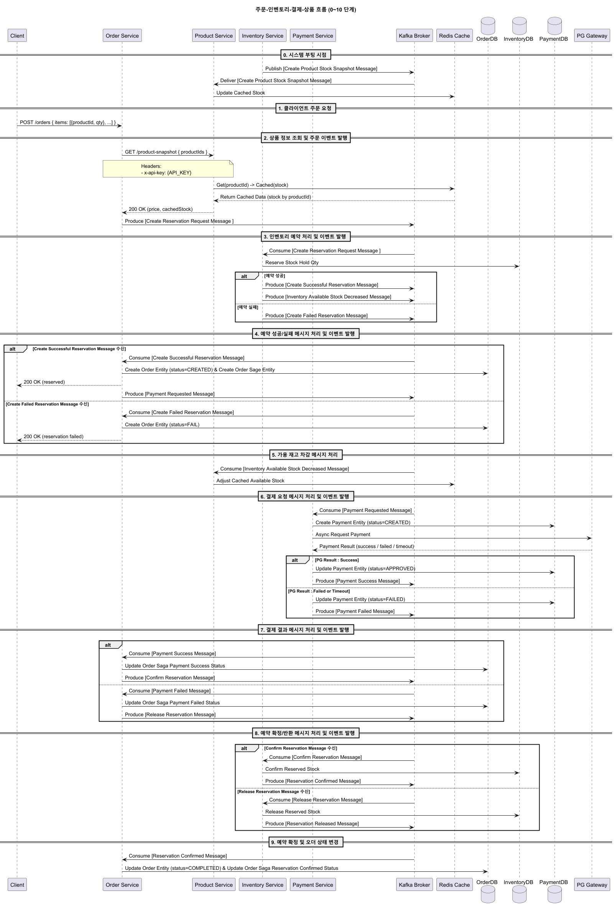

# kotlin-commerce-core

한줄 요약

Kotlin과 Spring Boot로 구현한 이벤트 기반 마이크로서비스(Orders / Inventory / Payment / Product) 입니다. Transactional Outbox, Lease,
Idempotency, Redis 캐시 등 실무용 신뢰성 패턴을 적용해 주문 생성에서 재고 예약·확정·해제, 결제 처리, 상품 재고 동기화에 이르는 전체 이벤트 흐름의 일관성과 신뢰성을 보장합니다. 서비스 간 통신은
Kafka로 이루어지며, Redis는 빠른 조회 성능을 위해 사용됩니다.

---

## 목차

- 개요
- 기술 스택
- 빠른 실행
- 아키텍처 & 책임 분리
- 서비스별 API 및 이벤트 요약
    - order-service
    - product-service
    - inventory-service
    - payment-service
- 주문 생성 시퀀스(단계별)
- Outbox 패턴(발행 흐름)
    - 단계별 요약
    - 핵심 SQL 예시
    - 퍼블리셔 의사코드 + 라인별 설명
    - 운영·튜닝 포인트
- 운영·튜닝 포인트 요약

---

## 개요

이 저장소는 주문-재고-결제-상품의 이벤트 기반 통합 흐름을 구현한 마이크로서비스 샘플입니다. 각 서비스는 Kafka로 이벤트를 교환하고, Outbox 패턴과 Lease(Claim-and-Lock), 멱등성 전략으로
메시지 유실 및 중복 발행을 방지합니다. Redis를 캐시로 사용해 조회 성능을 보완합니다.

---

## 기술 스택

- 언어/프레임워크: Kotlin, Spring Boot
- 데이터: PostgreSQL, Redis
- 메시징: Kafka (Zookeeper 포함)
- 테스트: JUnit, Mockito, TestContainers

---

## 빠른 실행

- 로컬 전체 스택 실행

```powershell
# 리포지터리 루트에서
docker compose build
docker compose up -d
```

- 이 구성은 루트 `docker-compose.yml`을 기준으로 Zookeeper/Kafka, Redis, 서비스별 Postgres 인스턴스(order/inventory/payment/product), 그리고 각
  서비스 컨테이너를 함께 기동합니다.
- 컨테이너 프로파일: `SPRING_PROFILES_ACTIVE=docker` → 서비스별 `application-docker.yml` 적용

기본 서비스 포트(로컬)

- product: 8080
- inventory: 8081
- payment: 8082
- order: 8083

CI: `.github/workflows/ci.yml` — `master` 푸시 시 각 서비스의 `./gradlew test` 실행 및 테스트 리포트 업로드

---

## 아키텍처 & 책임 분리

- `order-service`: 주문 생성, 멱등성 처리(Idempotency), Outbox 레코드 생성
- `inventory-service`: 재고 예약/확정/해제 처리, Reservation·Inventory 관리, Reservation 이벤트 발행
- `payment-service`: 결제 처리(Provider 추상화; InMemory 구현 포함), 결제 이벤트 소비/발행
- `product-service`: 상품 등록/조회, 재고 이벤트 수신 → Redis 캐시 갱신

서비스 간 통신은 Kafka 토픽을 통해 이벤트 형태로 이루어지며, 각 이벤트에는 `eventId` 등 공통 메타가 포함됩니다.

---

## 서비스별 API 및 이벤트 요약

### 1) order-service

- 역할: 주문 생성(멱등성 보장), 주문 목록 조회, Outbox 기반 이벤트 기록

- REST API
    - POST /api/orders
        - Request (JSON)

```json
{
  "idempotencyKey": "<UUID>",
  "userId": "user-123",
  "items": [
    {
      "productId": "<UUID>",
      "qty": 2,
      "unitPriceAmount": 199900,
      "unitPriceCurrency": "KRW"
    }
  ],
  "totalAmount": 399800,
  "currency": "KRW"
}
```

    - Response: 201 Created

```json
{
  "orderId": "<UUID>"
}
```

- GET /api/orders?userId={userId}&page={n}&size={m}
    - 주문 요약 페이지 반환(요약: orderId, userId, status, totalAmount, currency)

- Kafka / Outbox
    - OutboxRecord 필드 예: outboxId, orderId, eventType, idempotencyKey, payload, status, lease_owner, lease_until,
      attempts, next_attempt_at
    - 이벤트 예시

```json
{
  "eventId": "<UUID>",
  "orderId": "<UUID>",
  "eventType": "RESERVATION_CREATE_REQUEST",
  "payload": {
    "requestItem": [
      {
        "productId": "<UUID>",
        "qty": 2
      }
    ]
  }
}
```

---

### 2) product-service

- 역할: 상품 등록(관리자), 전체/단건 조회, 재고 이벤트 수신 시 Redis 캐시 반영

- REST API
    - POST /api/products (Header: `Idempotency-Key`)
        - Request: { productName, price, currency }
        - Response: { productId, productName }
    - GET /api/products/search/all
    - GET /api/products/search/{productId}

- Kafka(수신)
    - ProductInboundEvent: { eventId, eventType, payload }
        - payload 예: ProductCreatedPayload { productId, stock }, ProductStockIncrementPayload { orderId, productId,
          qty }

---

### 3) inventory-service

- 역할: Reservation 생성/확정/해제 처리(이벤트 소비), 재고 DB 갱신, ReservationOutboundEvent 발행

- 공개 REST API: 없음(이벤트 중심 처리)

- Kafka
    - 수신: ReservationInboundEvent { eventId, orderId, eventType, payload }
        - payload 예: ReservationCreatePayload { requestItem: [ { productId, qty }, ... ] }
    - 발행: ReservationOutboundEvent

---

### 4) payment-service

- 역할: 결제 생성·커밋·해제 처리(이벤트 기반), PaymentProvider 추상화

- 공개 REST API: 없음(이벤트 중심 처리)
- 결제 프로바이더(예): createPayment, commitPayment, releasePayment (비동기)
- Kafka: PaymentInboundEvent 수신 → 처리 → PaymentOutboundEvent 발행

---

## 주문 생성 시퀀스(단계별)

목적: 주문 생성에서 재고 예약, 결제 처리, 상품 재고 동기화에 이르는 전체 이벤트 흐름의 일관성과 신뢰성을 보장.


1) 클라이언트 요청: `POST /orders` (헤더: `Idempotency-Key`)
2) 주문 생성 트랜잭션: Order 저장 + Outbox INSERT (status=PENDING)
3) 응답 반환: 201 Created (orderId)
4) Outbox 퍼블리셔: PENDING 레코드 선점 → Kafka로 발행 → Outbox 상태 갱신
5) Inventory 처리: 예약 시도 → 성공/실패 이벤트 발행
6) 주문 상태 업데이트: Inventory/Payment 이벤트에 따라 주문 상태 보완
7) 결제 처리 및 보상/복구 로직
8) Product 서비스는 재고 이벤트로 Redis 캐시 갱신

---

## Outbox 패턴(발행 흐름)

목적: DB 트랜잭션과 메시지 브로커 간 원자성 확보 및 신뢰성 보장.


### 단계별 요약

1. 비즈니스 트랜잭션: 엔터티 저장 + Outbox INSERT (status=PENDING)
2. 트랜잭션 커밋
3. 퍼블리셔 선점: 짧은 TX로 PENDING 레코드 선점(claim)
4. 브로커 발행: DB TX 밖에서 publish
5. 상태 업데이트: 발행 성공 → SENT, 실패 → attempts/FAILED 기록
6. 장애·재시도: lease 만료·재시도·DLQ

### 핵심 SQL 예시(선점)

```sql
WITH cte AS (SELECT id
             FROM outbox
             WHERE status = 'PENDING'
               AND (lease_until IS NULL OR lease_until < now())
             ORDER BY created_at
    LIMIT 50
    FOR
UPDATE SKIP LOCKED
    )
UPDATE outbox
SET lease_owner='publisher-1',
    lease_until = now() + interval '30 seconds', status='SENDING'
WHERE id IN (SELECT id FROM cte)
    RETURNING id
    , event_id
    , payload;
```

### 퍼블리셔 워크플로(의사코드)

```pseudo
while true:
  txn:
    batch = claimPendingBatch(limit=N, leaseOwner=ME, leaseSeconds=T)
  for record in batch:
    try:
      publishToBroker(record.event_type, record.payload, record.event_id)
      markAsSent(record.id)
    except transientError:
      incrementAttempts(record.id)
      setLastError(record.id, error)
    except permanentError:
      markAsFailed(record.id)
  sleep(pollInterval)
```

라인별 설명 및 운영 팁은 문서 내에 상세히 정리되어 있습니다.

---

## 운영·튜닝 포인트

- 배치 크기(N)와 lease 기간(T) 튜닝(권장 출발점: N=50, T=30s)
- 재시도 정책: exponential backoff + jitter, attempts 임계값 → DLQ
- 모니터링: 처리률, 실패율, attempts 분포, lease 충돌률, Outbox 테이블 크기
- graceful shutdown: 인-플라이트 레코드 처리/lease 해제
