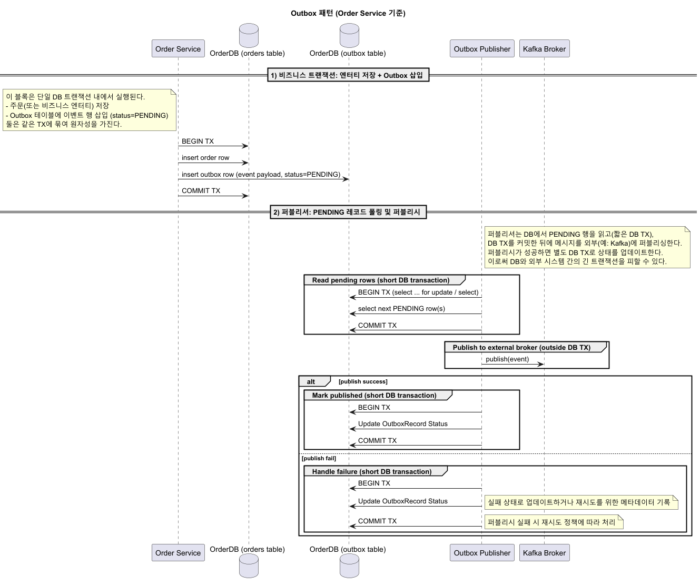

# Outbox 패턴(발행 흐름)

---

## 1. 개요

- 목적: DB 트랜잭션과 메시지 브로커 간의 원자성을 확보해 메시지 유실·중복을 방지.
- Outbox 패턴은 트랜잭션 일관성과 메시지 발행 신뢰성을 분리해 보장합니다.
- 퍼블리셔의 lease·재시도·멱등성 구현과 모니터링이 안정성의 핵심입니다.
- 방식: 비즈니스 트랜잭션 내에 Outbox 레코드를 기록하고, 별도 퍼블리셔가 이를 브로커로 발행.

## 2. Outbox 패턴 시퀀스



### 1) 비즈니스 트랜잭션

- 주문 생성 등 비즈니스 변경과 Outbox INSERT를 같은 DB 트랜잭션에서 수행한다.
- Outbox 행은 payload와 status=PENDING으로 저장된다.

### 2) 트랜잭션 커밋

- 비즈니스 트랜잭션이 커밋되면 Order와 Outbox 레코드가 영구화된다.

### 3) 퍼블리셔 선점(Claim / Lease)

- 퍼블리셔는 짧은 DB 트랜잭션으로 PENDING 레코드를 조회·선점(claim)한다.
- 선점 방식: `SELECT ... FOR UPDATE SKIP LOCKED` 또는 `UPDATE ... RETURNING` 패턴으로 lease를 설정한다.

### 4) 브로커로 발행(퍼블리시)

- 퍼블리셔는 DB 트랜잭션을 커밋한 뒤 외부 브로커(Kafka)로 이벤트를 발행한다.
- 발행은 DB 트랜잭션과 분리되어 실행된다.

### 5) 상태 업데이트

- 발행 성공 시 별도 DB 트랜잭션으로 Outbox 상태를 SENT로 갱신한다.
- 발행 실패 시 attempts·last_error를 기록하고 재시도 예정 또는 FAILED 처리한다.

### 6) 장애·재시도

- 퍼블리셔 장애: lease_until 만료 후 다른 인스턴스가 재시도한다.
- 브로커 장애: 지수 백오프·attempts 기록·운영자 개입(Dead Letter)으로 처리한다.

### 운영 포인트

- PENDING → SENT 지연 시간(퍼블리셔 처리율) 모니터링
- attempts 증가 및 last_error 빈도 알람
- lease 충돌률(선점 실패)과 lease 기간 튜닝
- Outbox 테이블 보관/정리 정책

## 4. 퍼블리셔 워크플로(의사코드)

```pseudo
while true:
  txn:
    batch = claimPendingBatch(limit=N, leaseOwner=ME, leaseSeconds=T)
  for record in batch:
    try:
      publishToBroker(record.event_type, record.payload, record.event_id)
      markAsSent(record.id)
    except transientError:
      incrementAttempts(record.id)
      setLastError(record.id, error)
    except permanentError:
      markAsFailed(record.id)
  sleep(pollInterval)
```

라인별 상세 설명

1) `while true:` — 퍼블리셔 루프 시작(데몬). 계속 실행되며 주기적으로 배치를 처리한다.
2) `txn:` — 배치 선점을 위한 짧은 DB 트랜잭션을 의미(원자적 선점).
3) `batch = claimPendingBatch(limit=N, leaseOwner=ME, leaseSeconds=T)` — PENDING 레코드 N건을 선점하며 lease(소유자, 만료)를 설정.
4) `for record in batch:` — 선점된 각 레코드에 대해 순회 처리.
5) `publishToBroker(record.event_type, record.payload, record.event_id)` — 브로커로 이벤트 발행; 성공 시 ACK 기반 확인을 권장.
6) `markAsSent(record.id)` — 발행 성공 후 별도 DB 트랜잭션에서 상태를 SENT로 변경 및 lease 해제.
7) `except transientError:` — 일시적 오류 처리(네트워크/타임아웃): 재시도 카운트 증가, last_error 기록, next_attempt_at 설정.
8) `except permanentError:` — 영구 오류 처리(스키마/데이터 문제): FAILED로 표시하고 DLQ/운영자 알림.
9) `sleep(pollInterval)` — 다음 폴링 전 대기; 부하·실시간성에 따라 조절.

운영 및 구현 고려사항

- `claimPendingBatch`는 `FOR UPDATE SKIP LOCKED` 또는 `UPDATE ... RETURNING`로 구현.
- 재시도 정책: attempts 임계값 초과 시 DLQ로 이동하거나 운영자 개입.
- 발행은 가급적 idempotent하게(동일 이벤트 재발행 허용) 설계.

운영·관측 포인트

- 처리률(초당 발행 수), 성공/실패 비율, 평균 레이턴시, attempts 분포를 수집해 알람 설정.
- lease 만료·충돌 비율을 모니터링해 leaseSeconds와 배치 크기를 튜닝.
- Outbox 테이블의 크기 증가 지표와 정리(archival) 정책 수립.

## 5. 멱등성 및 중복 방지

- 메시지에 `event_id` 포함: 소비자가 중복을 무시하도록 설계
- 퍼블리셔: lease와 상태 전이(PENDING→SENDING→SENT)로 중복 발행 방지
- 소비자: `event_id` 또는 dedup 테이블로 멱등성 보장

## 6. 배치·성능 고려사항

- 배치 크기(N)와 lease 기간(T)을 환경에 맞춰 조절
- 대량 처리 시 `SKIP LOCKED` 사용 권장
- 인덱스·페이징으로 PENDING 스캔 비용 최소화

## 7. 장애·복구 시나리오

- 퍼블리셔 다운: lease_until 만료 후 다른 인스턴스가 재시도
- 브로커 장애: 지수 백오프 재시도, attempts·last_error 기록
- 장기 실패: Dead Letter 또는 운영자 개입